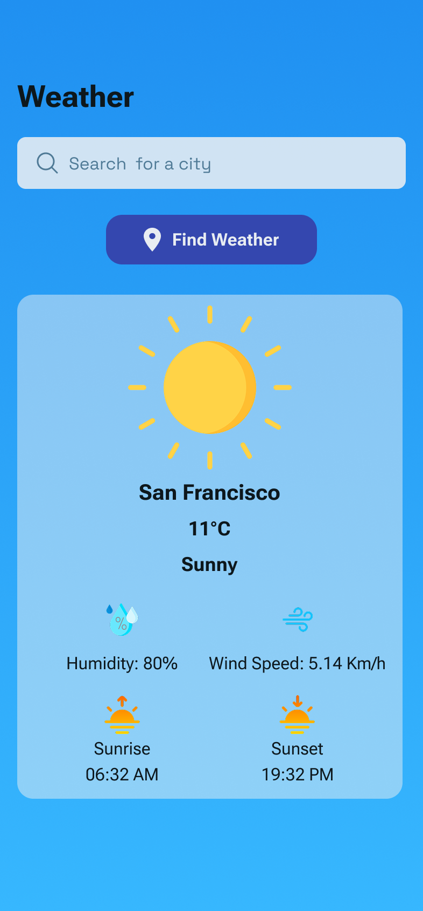

# 🌤️ Weather App

A clean and simple Flutter weather application that fetches and displays real-time weather information based on user input.

---

## 📱 UI Preview



---

## ✨ Features

- 🔍 **City Search** – Search for weather by city name.
- 🌡️ **Current Weather** – Displays temperature, weather condition, and an appropriate weather icon.
- 📊 **Weather Details** – Includes humidity, wind speed, sunrise, and sunset times.
- 🎨 **Custom Icons & Clean UI** – Minimal design with an intuitive layout.

---

## 🚀 Getting Started

### 1. Clone the Repository

```bash
git clone https://github.com/your-username/weather_app.git
cd weather_app
```

### 2. Install Dependencies

```bash
flutter pub get
```

### 3. Set Up the API Key

This app uses WeatherAPI to fetch weather data.
- Sign up and get a free API key from WeatherAPI.com.
- Create a .env file in the root directory of the project.
- Add your API key to the .env file like this:
```bash
API_KEY=your_api_key_here
```

### 3. Set Up the API Key
```bash
flutter run
```
---
## 📦 Dependencies
- http
- connectivity_plus
- flutter_dotenv
---
## ⚠️ Android NDK Note
If you encounter an error related to Android NDK versions (e.g., connectivity_plus requires a newer NDK), ignore it.

---
## 🙌 Acknowledgements

[WeatherAPI.com](https://www.weatherapi.com/) for the weather data API..